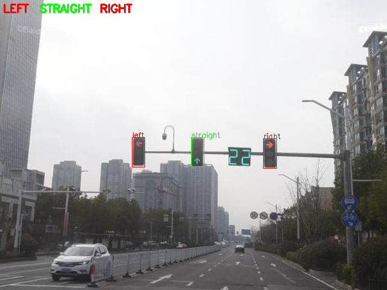
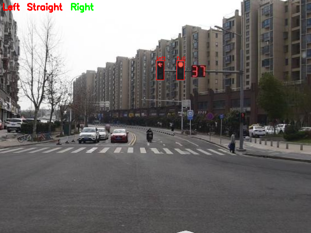

# Traffic Signal

**一种基于 YOLOv8 的路口交通信号灯通行规则识别模型及算法**

#### 模型简介

该模型自上而下共分为以下四个步骤：

1. **目标检测**，采用 YOLOv8 目标检测模型，识别图像中交通信号灯的位置及颜色。

2. **分组聚类**，对检测出的交通信号灯采用改进的层次聚类算法进行聚类，以加权的欧氏距离和尺寸差值作为相似度度量，以一定的相似度阈值作为停止条件，找出最有可能表示当前通行规则的信号灯组。

3. **信号分类**，对当前交通信号灯组中的所有信号灯，分别采用 YOLOv8 图像分类模型，将其表示的信号分为直行（Straight）、左转（Left）、右转（Right）和全部（Full）四类。

4. **规则解析**，对分类后的交通信号灯组，解析其表示的通行规则（即能否直行、能否左转和能否右转），有两种可选的解析策略：  
   
   - **保守策略**，黄灯视为红灯，若无明确表示可通行则视为不可通行。
   - **激进策略**，黄灯视为绿灯，若无明确表示不可通行则视为可通行。
   
   此外，对于以上两种策略，若无明确信号右转默认视为允许通行。

#### 效果展示

  

#### 性能评估

在 640x480 的图像输入下，平均推理一张图片的耗时约为 90ms，改用 OpenVino 推理平均耗时约为 54ms （CPU：11th Intel Core i5-1155G7 2.50GHz，Model：YOLOv8n）。

在当前数据集下目标检测：

| P     | R     | mAP50 | mAP50-95 |
| ----- | ----- | ----- | -------- |
| 0.921 | 0.947 | 0.971 | 0.791    |

同时在当前数据集下信号分类准确率接近 100%，模型的整体准确率暂未量化评估。

*<u>注：本项目主要用于学习和可行性研究，训练用的数据集规模较小，在真实工况下的鲁棒性可能不够理想。</u>*

