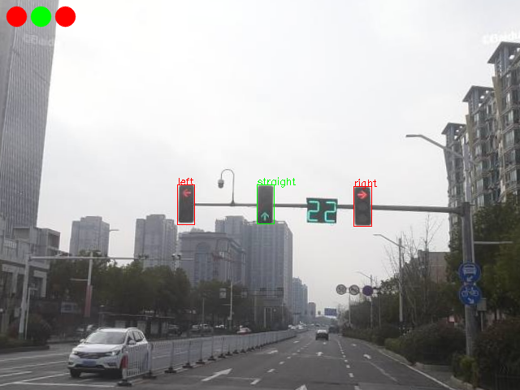

# Passing Rules

**一种基于 YOLOv8 的路口交通信号灯通行规则识别模型及算法**

## 项目简介

在本项目中，通行规则识别自上而下共分为以下四个步骤：

1. **目标检测**，采用 YOLOv8 目标检测模型，识别图像中交通信号灯的位置及颜色。

2. **过滤筛选**，对检测出的交通信号灯采用 DBSCAN 算法进行聚类，以加权的欧氏距离和j加权的尺寸差值作为相似度度量，从而筛选出最有可能表示当前通行规则的信号灯组。

3. **信号分类**，对当前交通信号灯组中的所有信号灯，分别采用 YOLOv8 图像分类模型，将其表示的信号分为直行（straight）、左转（left）、右转（right）和完全（full）四类。

4. **规则解析**，对分类后的交通信号灯组，解析其表示的通行规则（即能否直行、能否左转和能否右转），有两种可选的解析策略：  
   
   - **保守策略**，黄灯视为红灯，若无明确表示可通行则视为不可通行。
   - **激进策略**，黄灯视为绿灯，若无明确表示不可通行则视为可通行。
   
   对于大部分交通信号明确的情况下，两种策略的解析结果相同。此外，对于以上两种策略，若无明确信号右转默认视为允许通行。

## 效果展示

  

## 性能评估

在 640x480 的图像输入下，采用 PyTorch 平均推理一张图片的耗时约为 120ms，采用 ONNX Runtime 推理平均耗时约为 50ms（CPU：11th Intel Core i5-1155G7 2.50GHz，Model：YOLOv8n）。

在当前数据集下信号灯目标检测指标：

| P     | R     | mAP50 | mAP50-95 |
| ----- | ----- | ----- | -------- |
| 0.921 | 0.947 | 0.971 | 0.791    |

同时在当前数据集下信号分类准确率接近 100%，模型的整体准确率暂未量化评估。

*<u>注：本项目主要用于学习和可行性研究，训练用的数据集规模较小，在真实环境下的鲁棒性可能不够理想。</u>*

## 使用说明

首先安装环境依赖包，项目目前采用 ONNX Runtime 部署模型推理。

```bash
pip install -r requirements.txt
```

若需要使用 GPU 进行推理，则需要安装：

```bash
pip install onnxruntime-gpu
```

待识别图像默认在 <u>examples/sources/</u> 下 ，识别结果默认保存在 <u>examples/outputs/</u> 下，如果不存在请先创建。将所有待识别的图像放入待识别图像目录下，要求图像尺寸为 640x480，可以在本项目 Releases 中下载我训练好的模型权重文件，解压到项目中相应的位置（位于 <u>detect/weights/deploy/</u> 和 <u>classify/weights/deploy/</u>），运行 main.py 即可。

```bash
python main.py
```

本项目识别程序的默认配置文件为 <u>configs/config.yaml</u>，其中各个属性对应的含义如下：

```yaml
device: "CPU"        # 推理设备，"CPU" 或 "CUDA"
precision: "fp32"    # 推理运算精度，"fp32"（单精度）或 "fp16"（半精度）

detector:
  conf-threshold: 0.25   # 交通信号灯目标检测置信度阈值
  iou-threshold: 0.45    # 交通信号灯目标检测非极大值抑制 IoU 阈值

filter:
  weights: [0.05, 5, 2, 2]    # 过滤器相似度权重系数，为一个四元组，依次为 x 轴权重、y 轴权重、宽度权重和高度权重
  threshold: 40               # 过滤器 DBSCAN 聚类距离半径阈值

strategy: "conservative"    # 通行规则识别策略，“conservative”（保守策略） 或 “radical”（激进策略）
```

如果需要使用自己的数据集训练模型，则需要安装 ultralytics 框架，参照 [Ultralytics 官方文档](https://docs.ultralytics.com/) 进行模型的训练，最后将模型转换为 ONNX 格式进行部署即可。

```bash
pip install ultralytics
```
